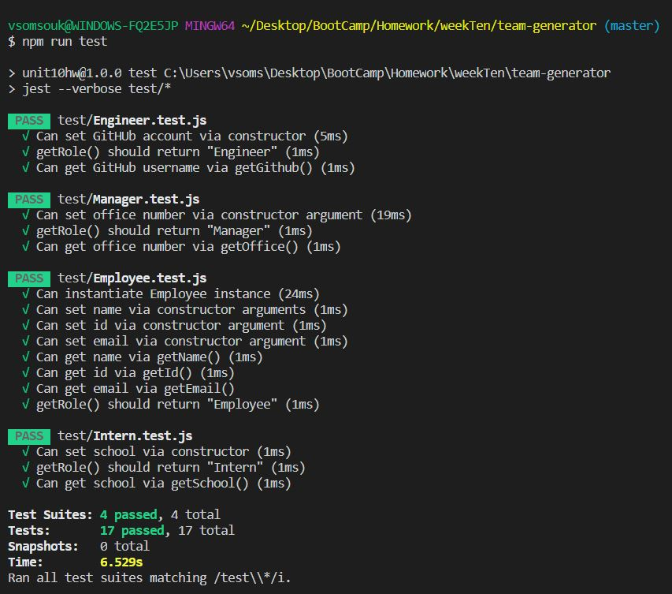
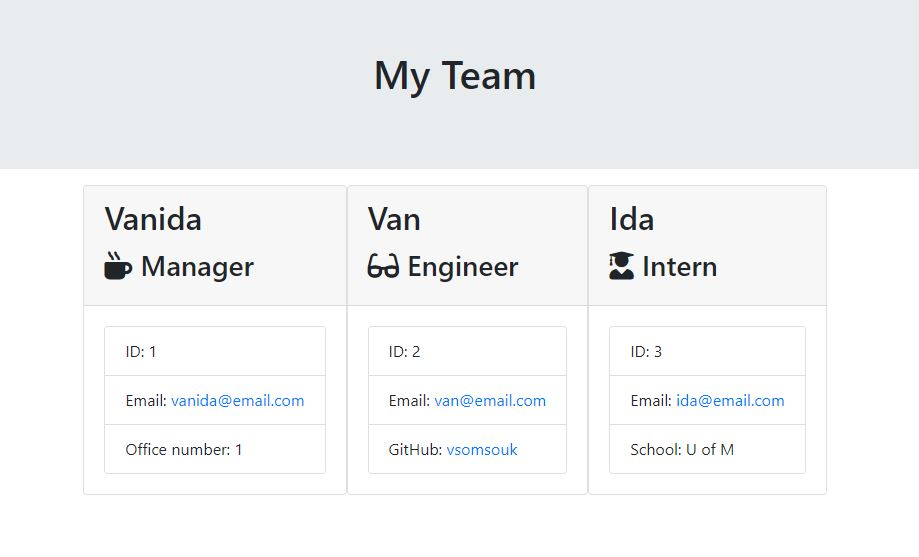

# Team Generator

## Description
Creating a command line application that will prompt the user for information about the team (Manager, Engineer and Intern) with Node. Once information has been added, a HTML file will generate and organize the information in a template given. This assignment must also pass all unit tests.

## Installation
npm install

## License
MIT

## Tests
* npm run test

## Screenshot

## Questions:
If you have any questions, please feel free to email me at vsomsouk@gmail.com.

